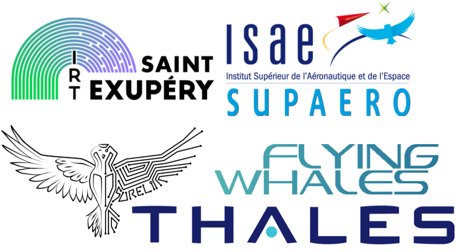

[](https://pre-commit.com/) [](https://github.com/psf/black) [](https://github.com/astral-sh/ruff)

## Robust Reinforcement Learning Suite (rrls)


### Goal
The goal of rrls is to standardize robust reinforcement learning benchmarks, ensuring that experiments are reproducible and comparable. `rrls` is designed to follow the `gymnasium` API.

---

## 📦 Installation

**From source**:

```bash
# We have to install the latest version of gymnasium
git clone https://github.com/Farama-Foundation/Gymnasium.git

cd Gymnasium

pip install .

pip install git+https://github.com/SuReLI/RRLS.git

```

**Available when Gymasium 1.0 is released**

Via pip:

```bash
pip install rrls
```

**Prerequisites**:
- Ensure you have MuJoCo installed on your machine. The environments provided by `rrls` require the MuJoCo physics engine from Deepmind. For detailed installation instructions, please refer to the [MuJoCo website](https://mujoco.org/) and the [MuJoCo Github repository](https://github.com/deepmind/mujoco).
- We have tested and support Python versions 3.9, 3.10, and 3.11 on both Linux and macOS.


## 🤖 Environments

The package offers the following environments:

| Environment Name     | id                                     |
|----------------------|-------------------------------------------|
| Ant                  | `robust-ant-v0`       |
| HalfCheetah          | `robust-halfcheetah-v0`|
| Hopper               | `robust-hopper-v0`    |
| HumanoidStandup      | `robust-humanoidstandup-v0` |
| InvertedPendulum     | `robust-invertedpendulum-v0` |
| Walker2d             | `robust-walker2d-v0`  |

And lot more ... if you want to get a full list of the environments, you can use the following code:

```python
import gymnasium as gym
for env in gym.envs.registry:
    if "rrls/robust" in env:
        print(env)
```

### Example of usage:

```python
import gymnasium as gym
import rrls

env = gym.make("rrls/robust-ant-v0")
params = env.get_params()  # Parameters will be None if reset method hasn't been called.

# Set all parameters to 1
params = {k: 1 for k in params.keys()}

# Modify environment parameters during reset using the options argument
obs, info = env.reset(options=params)

# Retrieve environment parameters from the info dictionary
print(info["torso_mass"])  # Outputs: all keys are equals to one 1

terminated, truncated = False, False

while not (terminated or truncated):
    action = env.action_space.sample()
    obs, reward, terminated, truncated, info = env.step(action)
    print(info["torso_mass"])

    # To change environment parameters during an episode, use the set_params method.
    # env.set_params(params)
```


## 🌯 Wrappers

The package provides the following wrappers:
- **Domain randomization**: `rrls.wrappers.DomainRandomization`
- **Probabilistic action robustness**: `rrls.wrappers.ProbabilisticActionRobust`
- **Adversarial dynamics**: `rrls.wrappers.DynamicAdversarial`


## 👝 Uncertainty sets

For each environment, we offer a set of uncertainty sets for use. For instance:

```python
from rrls.envs.ant import AntParamsBound
```

This `Enum` includes three variants: 1D, 2D, and 3D uncertainty sets, as referenced from the [M2TD3 paper](https://arxiv.org/abs/2211.03413). For instance, the 2D uncertainty set for the Ant environment is defined as follows:

```python
from rrls.envs.ant import AntParamsBound

params_bound_2d = AntParamsBound.TWO_DIM.value
# {'torsomass': [0.1, 3.0], 'frontleftlegmass': [0.01, 3.0]}
#                ^^^  ^^^
#                min  max
```

Also you can get the uncertainty set provided by the [RARL paper](https://arxiv.org/abs/1703.02702)

```python
from rrls.envs.ant import AntParamsBound
rarl_params_bound = AntParamsBound.RARL.value
# {
#         "torsoforce_x": [-3.0, 3.0],
#         "torsoforce_y": [-3.0, 3.0],
#         "frontleftlegforce_x": [-3.0, 3.0],
#         "frontleftlegforce_y": [-3.0, 3.0],
#         "frontrightlegforce_x": [-3.0, 3.0],
#         "frontrightlegforce_y": [-3.0, 3.0],
#     }

```

## 🤓 Evaluate

If you want benchmark worst-case performance using our extensive suite. For every uncertainty set, we provide a corresponding set of evaluation environments. These environments are created by equally partitioning (into 10 segments) each dimension of the uncertainty set.

```python
from rrls.evaluate import EVALUATION_ROBUST_ANT_3D # Set consisting of 10^3 environments
```

If you wish to construct your own custom set of environments, you can utilize the code below:

```python
from rrls.evaluate import generate_evaluation_set
from rrls.envs.ant import AntParamsBound, RobustAnt

eval_env_set = generate_evaluation_set(
    modified_env=RobustAnt,
    param_bounds=AntParamsBound.THREE_DIM.value,
    nb_mesh_dim=3,
)
```

## 📖 Project Maintainers

- [Adil Zouitine](https://github.com/AdilZouitine) - IRT Saint-Exupery, ISAE Supaero, & Sureli Team
- [David Bertoin](https://github.com/DavidBert) - IRT Saint-Exupery, INSA Toulouse, ISAE Supaero, & Sureli Team
- [Emmanuel Rachelson](https://github.com/erachelson) - ISAE Supaero & Sureli Team
- [Pierre Clavier](https://github.com/pierreclavier) -  Ecole polytechnique and Inria Paris


## 🙏 Acknowledgments

This project is part of the ENVIA initiative, aiming to develop next-gen reinforcement learning controllers for airship transportation of heavy loads. We are grateful to our supporters:

- **Sureli Team**
- **Isae Supaero**
- **IRT Saint Exupéry**
- **Thales**
- **Flying whales**


